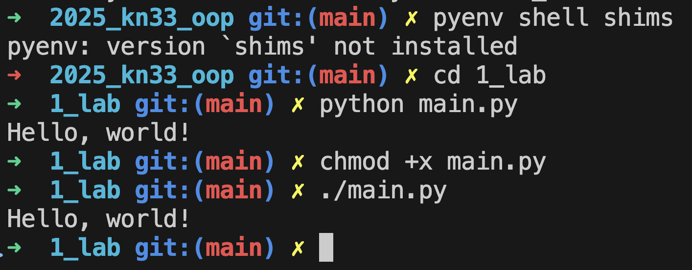

# Звіт до роботи
## Тема: _Вступні заняття: налаштування середовища, прочаток роботи з Python та Markdown;_
### Мета роботи: _Налаштувати середовище роботи VS Code, створити репозиторій Github та налаштувати інтеграцію з ним, написати першу програму на Python та створити звіт з використанням форматування Markdown;_

---
### Виконання роботи
* Результати виконання завдань:
    1. Налаштували середовище, встановили Python, навчились працювати з Markdown та починаємо писати програми.
    1. Створили файли в яких будемо писати першу програму:  
    [файл з програмою на Python](main.py)  
    [Python ноутбук з інтерактивним виконанням коду](note.ipynb)
    1. Запустили програму за допомогою різних способів і програма вивела значення представлене на 
    1. Спробували попрацювати у Python ноутбуці, всі комірки виконались успішно, [>>>>>тиць<<<<<<](note.ipynb)
    1. Навчились налаштовувати середовище Python, коористуватись `ipynb`, як вставляти гіперпосилання, запукати Пайтон програми.


* створили запит до Copilot який створ в програму представлену нижче:
    ```python
    print("Hello, world!")
    ```
* оформили звіт та завантажили всі файли у Github;

---
### Висновок:
> у висновку потрібно відповісти на запитання:

- :question: Що зроблено в роботі;
- :question: Чи досягнуто мети роботи;
- :question: Які нові знання отримано;
- :question: Чи вдалось відповісти на всі питання задані в ході роботи;
- :question: Чи вдалося виконати всі завдання;
- :question: Чи виникли складності у виконанні завдання;
- :question: Чи подобається такий формат здачі роботи (Feedback);
- :question: Побажання для покращення (Suggestions);

---