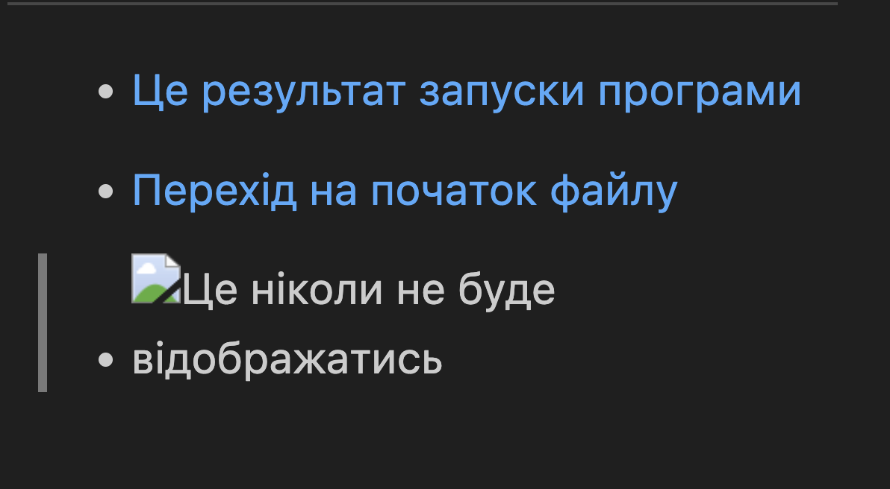

# Вчимось працювати з Markdown
## Пробуємо організувати секції
1. Ми вчимось робити списки
3. Ми поміняли місцями списки
2. І тут є **_бага яка є фічою_**
1. це ми просто додали ще один список
1. Тобто ми можемо завжди ставити 1
1. Щоб Вас __*більше запутати*__ ...
1. ***Якщо 3* зірки**


## Вчимось оформляти текст
- __Написали багато тексту__
* *треба* його поправити
+ і ми змучились і почали ~~байдикувати~~

Коли ми будемо писати довгий текст то його скролять зазвичай в право, але як ми можемо бачити рендеринг відбуваться у вигляді абзацу 
а тут я просто поставив Ентер щоб прейти на нову стрічку

Якщо хочете організувати тикст у абзаци то просто залишайте одну пусту стрічку  
Якщо в кінці стрічки ми залишаємо 2 пробіли та ставимо Ентер то це також буде перехід абзацу. 

## Робота з посиланнями
- [Це результат запуски програми](test.txt)

- [Перехід на початок файлу](#вчимось-працювати-з-markdown)

- 

> [!WARNING]
> якась порада

## Виділення коду
Якщо ми просто виділяємо код ставлений у текст то `code test`

```bash
cd ../
pwd
```

1. Наприклад можемо вставити індивідуальне завдання по коду
    ```python
    print("Hello")
    ```

| Заголовок1|Заголовок2 |
|:---:|:---:|
|1|2|
|3|4|

